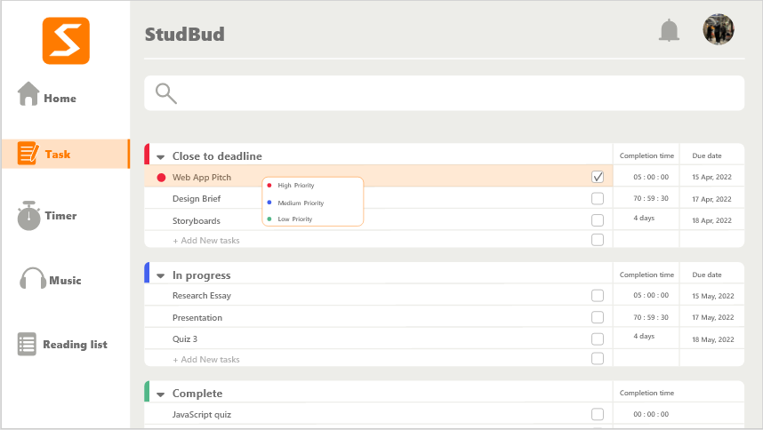

# Read Me
## Contents
1. [Instruction](#instruction)
2. [Iteration](#iteration) 
3. [Reference-list](#Reference-list)

### Instruction 
***
This web app helps students manage their studies. First, it has task lists and Covey Quadrants, which help them manage tasks better. Secondly, it has stopwatch and Pomodoro Timer, which can help students better plan their study time. In addition, it also has a music player function, which allows students to listen to music while studying to reduce their stress. Finally, it has a feature called Reading List Creator, which helps students organize information for their reference materials.

Remark:
1. To view the style of a webpage opened on a desktop device, enter "node app.js" in the terminal of VScode to obtain some links, such as" http://127.0.0.1:3000 ", and add "/home. HTML" after this link to open the webpage in the browser.
2. To open a web page on a mobile device, enter ipconfig in cmd.exe to obtain the IPv4 address, for example, 192.168.3.214. Then in the mobile browser input for IPv4 addresses, plus ": 3000/home. HTML", such as "192.168.3.214:3000/home. HTML".

## Iteration
***
In the process of realizing the functions of the web application, I have simplified the layout and functions of some pages, and I have also made some changes to some interfaces I designed before according to the requirements of Design Brief.  
* [Home page](#homepage)
* [Task](#task)
* [Timer](#timer)
* [Music](#music)
* [Reading list](#readinglist)
  
### Home page
In the previous Home Page I designed, each module on the right of the interface has some functions of the corresponding interface.  As shown in figure 1.  For example, the Timer module has the timing function.  However, for now, I don't think these features are necessary in the home page.  Therefore, I simplified the functions of the modules on the right side of the interface, only allowing them to jump to different pages.  As shown in figure 2.  

### Task
Figure 3 is an interface with task lists and Covey Quadrants that I designed in my last assignment.  I imagined that users could distinguish the importance of each task by choosing a different color for the circle in front of each task;  The system then divides each task into different tables based on how long it is before the deadline.  However, this conflicts with the need for systematic calculations to distinguish between the urgency and importance of tasks.  
So I rearranged the tables in the interface.  I kept the Complete form.  The user can indicate that the task has been completed by clicking on the rounded square to the right of the task.  The checked tasks are moved to the Complete table.  I divided The other four tables according to The Time Management for Students matrix.  They are: urgent and important;  Urgent but unimportant;  Not urgent but important;  Not urgent and not important.  The urgency of the task is judged by the deadline.  Tasks that are close to the deadline are considered urgent.  In addition, when you edit a task in the input box at the top of the interface, you need to select whether the task is important.  After that, the system will divide the tasks into corresponding tables according to the importance of the task selected by the user and the time before the deadline of the task.  

### Timer
The Timer interface needs to have timing and Pomodoro Timer functions.  After the last assignment, I changed the style of the Pomodoro Timer to the one shown in Figure 5.  However, I don't think this clearly shows the timing pattern.  Therefore, I changed the interface of Pomodoro Timer to the style shown in Figure 6, in order to clearly show its timing mode.  O Default times = 25 mins on, 5 mins off (X4) then 30 mins break.  

### Music
In the last assignment, I added a function to the music interface that you can click on the name of the corresponding song to go to the next page to view their lyrics.  As shown in figure 7.  Later, it occurred to me that students have their own music apps, so maybe the music interface doesn't need much functionality.  Maybe it just needs to provide students with some soothing soft music to help them calm down when they are tired.  So I removed the lyrics screen and added three soothing songs to the music screen.  

### Reading list
Figure 8 is the interface of the Reading List I designed earlier.  It works like Excel, and you can change the information in it by clicking on the corresponding grid.  For example, clicking on the reference link can delete the link and replace it with a new one.  
You don't need too many grids to start with.  So I cut out some of the original grid.  As shown in figure 9.  

## Reference-list
***
1. Time Management for Students Matrix.(2017). Retrieved from [https://www.triplem.com.au/story/change-the-course-of-a-child-s-life-this-christmas-with-the-smith-family-153163](http://www.mytimemanagement.com/time-management-for-students.html)